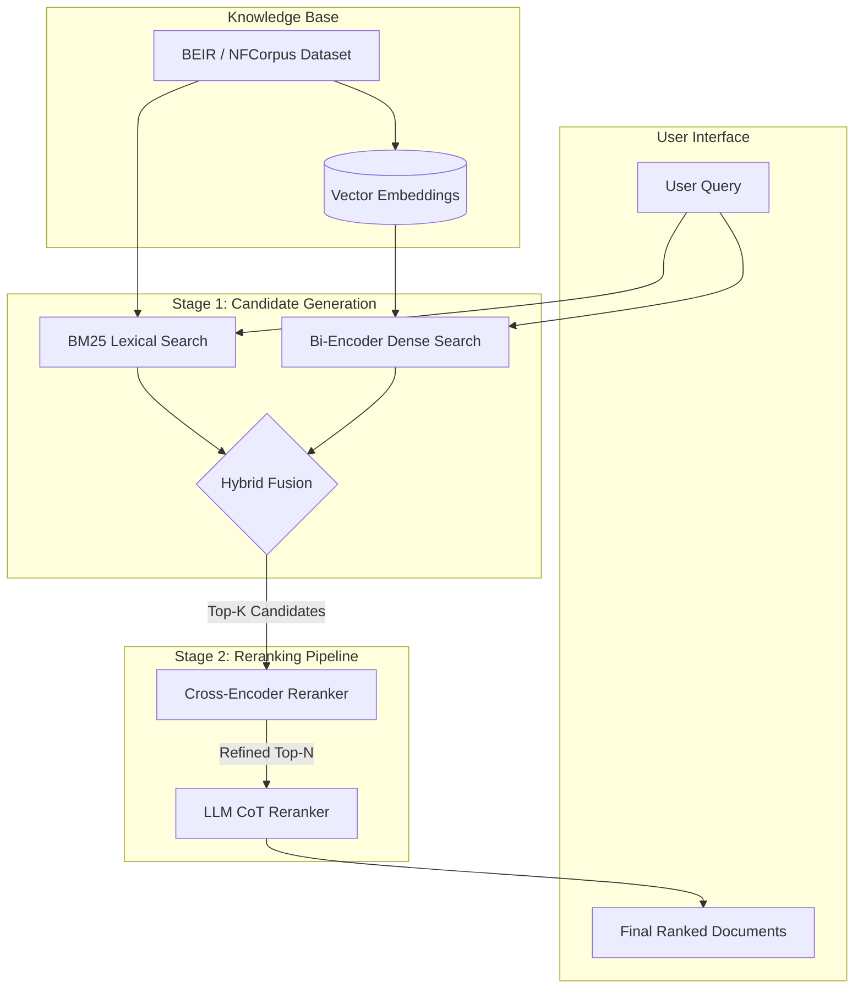
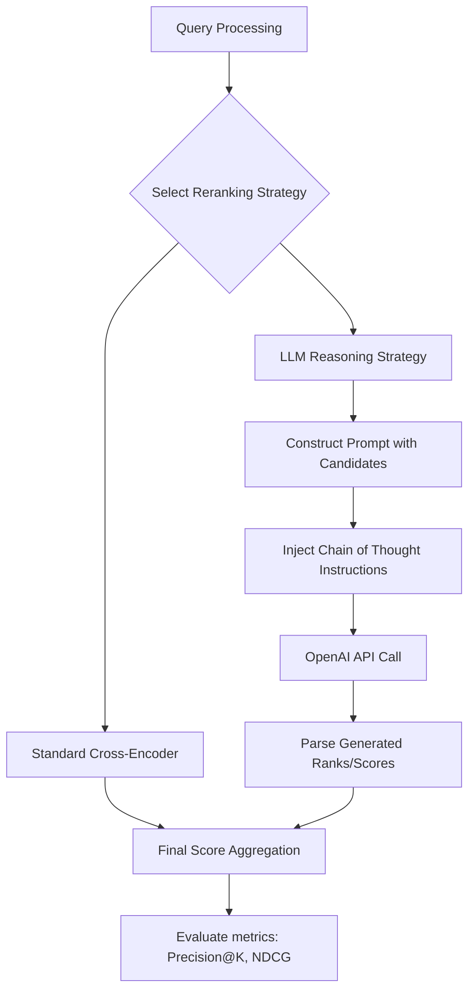

<div align="center">
  
</div>

---

# Neural and Hybrid Information Retrieval with LLM Reranking

This project presents a comprehensive, multi-stage Intelligent Information Retrieval (IIR) framework. It explores the full spectrum of modern search technologies, transitioning from traditional lexical models to state-of-the-art Large Language Model (LLM) reranking architectures. The pipeline is designed to evaluate, fine-tune, and hybridize various retrieval methodologies to achieve optimal precision and recall.

<div align="left">
  <a href="https://www.python.org/"></a>
  <a href="https://pytorch.org/"></a>
  <a href="https://huggingface.co/"></a>
  <a href="https://huggingface.co/docs/peft/index"></a>
  <a href="https://openai.com/"></a>
  <a href="#"></a>
  <a href="https://opensource.org/licenses/MIT"></a>
</div>

## Abstract
Modern search systems require a delicate balance between computational efficiency and semantic understanding. This project demonstrates the implementation and comparative analysis of a multi-tiered retrieval system. It begins with foundational lexical search (BM25) and Bi-Encoder dense retrieval, advances through Cross-Encoder reranking pipelines, and implements both full and Parameter-Efficient Fine-Tuning (LoRA) to adapt models to domain-specific data (BEIR/nfcorpus). Finally, it introduces a cutting-edge LLM-based reranking mechanism utilizing Chain of Thought (CoT) reasoning to achieve maximal retrieval accuracy.

## Table of Contents
1. [Overview](#overview)
2. [Key Features](#key-features)
   - [Retrieval Methodologies](#retrieval-methodologies)
   - [Model Fine-Tuning](#model-fine-tuning)
3. [System Architecture](#system-architecture)
   - [Inference Pipeline](#inference-pipeline)
   - [Fine-Tuning Workflow](#fine-tuning-workflow)
4. [Agent Workflow & Reranking](#agent-workflow--reranking)
5. [Tools and Technologies](#tools-and-technologies)
6. [Dataset Details](#dataset-details)
7. [Project Structure](#project-structure)
8. [Installation](#installation)
9. [License](#license)
10. [Author](#author)
11. [Support](#support)

# Overview
This framework serves as a robust environment for evaluating and enhancing Information Retrieval systems. Instead of relying on a single retrieval paradigm, the system orchestrates a hybrid approach, leveraging the speed of lexical/dense retrievers for initial candidate generation, and the deep semantic comprehension of Cross-Encoders and LLMs for precise reranking. 

# Key Features

### Retrieval Methodologies
*   **Lexical Retrieval:** Implementation of BM25 (Okapi) for exact-match and keyword-based search.
*   **Dense Retrieval:** Bi-Encoder architecture utilizing SentenceTransformers for semantic vector search.
*   **Hybrid Search:** Intelligent combination of lexical and dense scores with dynamic weight tuning (Lambda parameter).
*   **Neural Reranking:** High-precision re-evaluation of top-K results using Cross-Encoder models.
*   **LLM-Based Reranking:** Zero-shot/Few-shot reasoning using OpenAI's GPT models (Chain of Thought) to reorder documents based on deep contextual relevance.

### Model Fine-Tuning
*   **Triplet Construction:** Implementation of Hard Negative Mining to improve embedding separation.
*   **Full Fine-Tuning:** Updating all model parameters for domain adaptation.
*   **Parameter-Efficient Fine-Tuning (LoRA):** Low-Rank Adaptation to prevent catastrophic forgetting and reduce computational overhead.

---

# System Architecture
The architecture is divided into two primary pipelines: The Retrieval/Inference Pipeline and the Fine-Tuning Workflow. The system first retrieves a broad set of candidates and then systematically refines them.



### Architectural Components

| Component | Responsibility |
|---------|---------------|
| **Candidate Generation** | Fast retrieval of Top-K documents using Sparse (BM25) and Dense representations. |
| **Hybrid Fusion** | Merging normalized scores from multiple retrieval methods to maximize recall. |
| **Cross-Encoder** | Deep token-level cross-attention between Query and Document for accurate scoring. |
| **LLM Reranker** | Applying generative reasoning to evaluate document relevance logically. |
| **LoRA Adapters** | Domain-specific knowledge injection without altering base model weights. |

---

# Agent Workflow & Reranking



---

# Tools and Technologies

| Component | Purpose |
| -------------------- | ------------------------------- |
| **PyTorch** | Core Deep Learning Framework |
| **SentenceTransformers**| Dense Embeddings & Cross-Encoders |
| **Rank-BM25** | Lexical Search Implementation |
| **PEFT (HuggingFace)** | LoRA Fine-Tuning |
| **OpenAI API** | LLM-based Zero-shot Reranking |
| **Datasets (HF)** | Data Loading and Management |
| **Scikit-learn/Numpy** | Metric Calculation and Matrix Operations |

---

# Dataset Details
The project utilizes the **BEIR/nfcorpus** dataset, a specialized domain dataset for Information Retrieval evaluation.
*   **Documents:** ~3,633 medical/scientific text documents.
*   **Queries:** ~3,237 total queries.
*   **Training Queries:** ~2,590 queries with relevance judgments (qrels) used for fine-tuning.

---

# Project Structure

```text
Neural-Hybrid-IR-with-LLM-Reranking
│
├── Intelligent_Retrieval_Pipeline.ipynb
│
├── data/
│   ├── (Downloaded BEIR/nfcorpus files)
│
├── requirements.txt
│
└── README.md
```

---

# Installation

## Clone Repository
```bash
git clone https://github.com/farzadjannati/Neural-Hybrid-IR-with-LLM-Reranking.git
cd Neural-Hybrid-IR-with-LLM-Reranking
```

## Create Environment
```bash
conda create -n neural_ir python=3.10
conda activate neural_ir
```

## Install Dependencies
```bash
pip install -r requirements.txt
```
*(Ensure you install `datasets`, `sentence-transformers`, `rank_bm25`, `peft`, `transformers`, and `openai` as specified in the notebook.)*

---

# License
This project is licensed under the MIT License. 

---

## Author

**Farzad Jannati**  
M.Sc. Student, University of Tehran  
Research Assistant @ Social Networks Lab  
**Research Interests:** NLP, Large Language Models (LLMs), Agentic AI, Retrieval-Augmented Generation (RAG), Information Retrieval  

📧 [farzadjannati@ut.ac.ir](mailto:farzadjannati@ut.ac.ir) | 💻 [github.com/farzadjannati](https://github.com/farzadjannati) | 💼 [linkedin.com/in/farzadjannati](https://www.linkedin.com/in/farzadjannati)

---

# Support
If you find this project useful for your research or development, consider giving it a star ⭐

---

<p align="center">
  Built with ❤️ using PyTorch, HuggingFace, PEFT, and OpenAI
</p>
